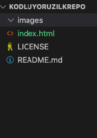

# Kodluyorz İlk Repo

Bu repo [Kodluyoruz](https://www.kodluyoruz.org/) Java Spring Boot Camp için ön hazırlık olan git eğitimi ile olusturulmus bir repo. İçinde bir adet README dosyası ve bir adet index.html var.

## Installation

Öncelikle projeyi klonlayın.

```cd kodluyoruxilkrepo
git clone https://github.comxxx/kodluyoruz/ilkrepo.git
```


## Usage

Klonlama sonrası visual studio code programını açın.

Linux için:

```cd kodluyoruxilkrepo
cd kodluyoruzilkrepo
code .
```


## Contributing

Pull requestler kabul edilir.


## License

[MIT](https://en.wikipedia.org/wiki/MIT_License)



